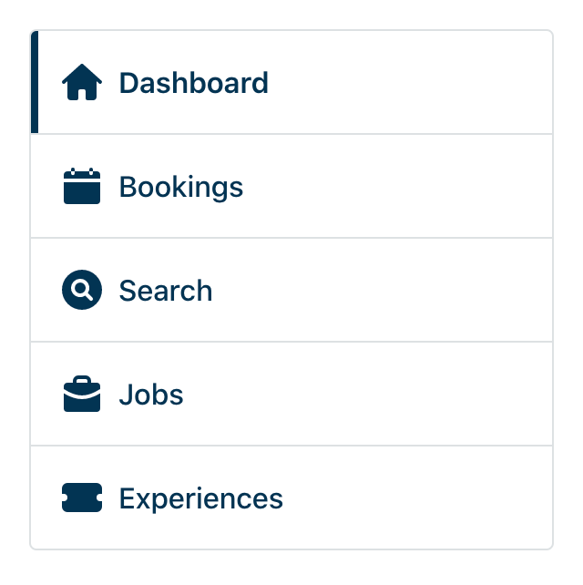
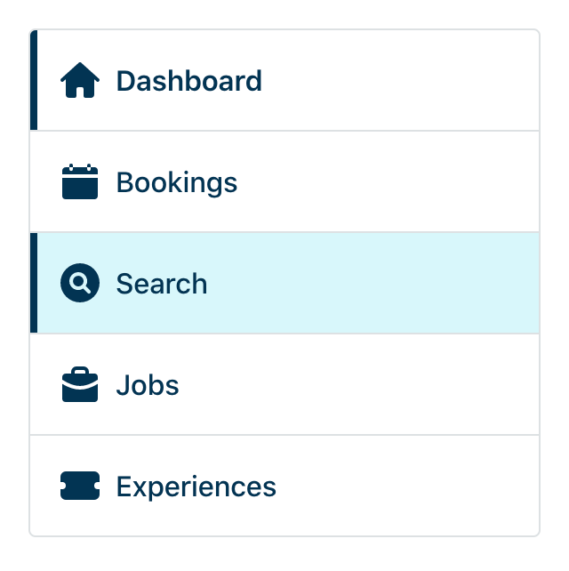
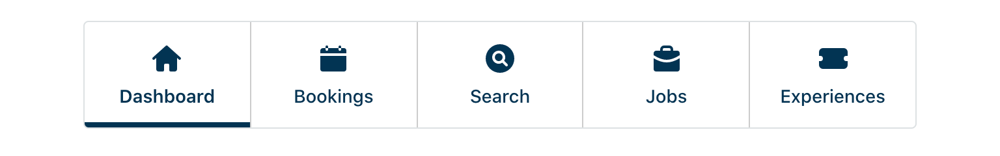
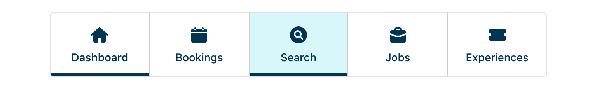

# UI Assessment

To get a feel for how you build UI, we'd like to you to demonstrate your understanding of design, HTML, CSS, accessibility and JavaScript.

The timeframe will probably not allow you to code as if it were production-ready, however, we'd like you to demonstrate thought processes and implementation details required, assuming you were building this for production.

While there are small-screen and wider-screen layout designs provided, it's important to note that they are simply suggestions. No explicit sizes will be provided. Feel free to implement or suggest changes that you feel creates a better experience.

To complete the task, you can choose to use vanilla HTML & CSS, [React](https://facebook.github.io/create-react-app/), or [Vue](https://cli.vuejs.org/).

**Please note:** you are free to search for any relevant resources you may need in completing this task. We do not expect you to complete this entirely from memory.

## Timeframe

| Duration | Description   |
| ---------| ------------- |
| 10mins   | Introductions |
| 1hour    | Task          |
| 20mins   | Questions     |

## Task

### Design

#### Narrow

Narrow device when Dashboard is the current page:

Narrow device when Search is interacted with by the user:

#### Wide

Wide device when Dashboard is the current page:

Wide device when Search is interacted with by the user:

#### Wide

### Items

The navigation items are:

1. Dashboard (`/dashboard`)
2. Bookings (`/bookings`)
3. Search (`/search`)
4. Jobs (`/jobs`)
5. Experiences (`/experiences`)

### Requirements:

- The navigation contains 5 links with relevant icons.
- On wide screens the links are presented in a row.
- On narrow screens the links are presented in a column.
- When a link is the current page it should be indicated as such.
- When a link is interacted with it should have the relevant styles.
- Use the provided SVGs in `/assets` for the icons.

### What is being evaluated

- How the label the navigation to provide context for accessibility technologies to understand it is a "Main navigation"?
- How to markup a navigation for accessibility?
- How to represent an active link in the navigation?
- How would you approach including the SVG icons?

**Question:** While there are only few SVGs here, how might we best accommodate a system of more SVGs?

### Styles

#### Fonts

For the purposed of this exercise we will use the `system-ui` font stack.

**Question:** If we required a custom typeface, what would be your approach? What are the potential risks of using a custom typeface?

#### Colors

| Color       | Hex       |
| ----------- | --------- |
| Base        | `#003453` |
| Border      | `#dde1e3` |
| Hover/Focus | `#d8f7fb` |

**Question:** What would be your approach to organise colors in a larger palette? How would you maintain colors as part of a wider design system?
